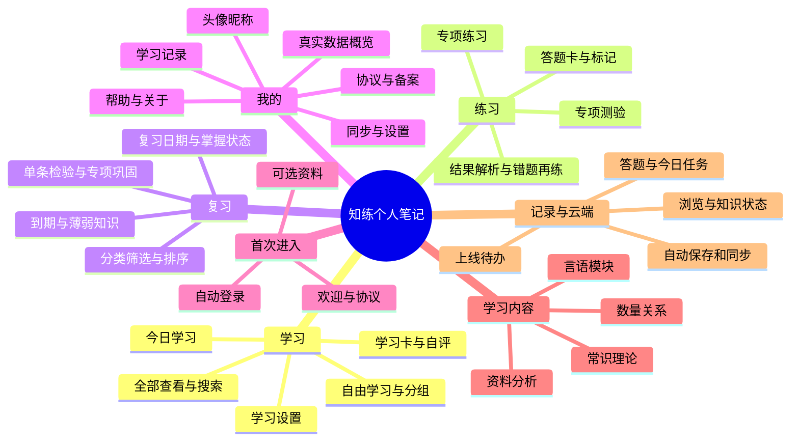
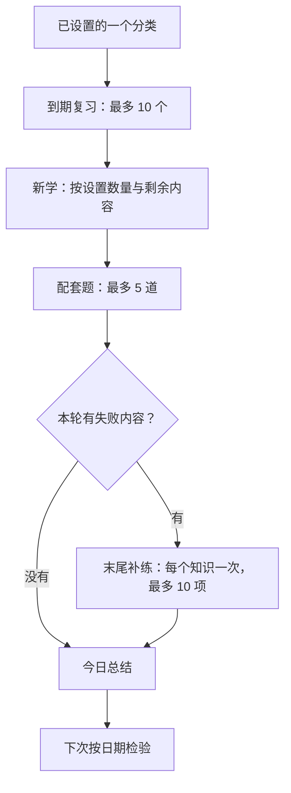

# 知练个人笔记 · 功能思维导图与逻辑说明

> **历史快照提示（2026-09-07）**：本页、离线导图和 FreeMind 文件保留 2026-09-06 的旧 V4 功能快照。学习、复习、学习设置及其状态／同步规则已由 [V5 学习与复习](../v5-learning.md) 取代；当前底栏为学习／练习／我的，复习从首页直达，个人中心不再保留同步状态与手动重试入口；下面的固定间隔、配套题和再练链等内容只用于理解历史，不是当前实现要求，也不是本轮验证证据。其他功能线索仍需按当前代码核对。

> 功能快照：2026-09-06。代码基线：`9db5e5e`。按 23 个注册页面及相关逻辑核对；内容数从当前题库读取。本文是现状说明，不是新需求方案或上线验收结论。

[打开可展开的功能导图](index.html) · [可编辑思维导图文件（FreeMind 格式）](features.mm)

导图可以直接在浏览器离线打开。建议先看“学习 · 练习 · 复习”，再看内容清单，最后按 R1—R10 整理修改意见。当前不更改小程序功能。

## 1. 先分清五个入口

| 入口 | 谁决定内容 | 怎么进行 | 数量 | 影响记录 |
| --- | --- | --- | --- | --- |
| 今日学习 | 系统按一个已选分类安排当天任务 | 先复习 → 新学 → 配套题 → 必要时再练 | 新学 1～200；另加复习 ≤10、配套题 ≤5、再练 ≤10 | 今日任务进度 + 知识状态 + 实际作答 |
| 自由学习 | 用户自己挑模块、分类与分组 | 看学习卡、展开解析、自评、按需练本组 | 成语 / 三字词每组 ≤20；关联词每组 5 类关系；本组练习 ≤5 题 | 阅读位置 + 知识状态；不自动勾掉今日任务 |
| 专项练习 | 用户选分类，或其他入口带来题目 | 逐题确认，立即看解析 | 一般选 10 / 20；本组 ≤5、复习专项 ≤10、单条通常 1 | 即时答题记录 + 知识状态 |
| 专项测验 | 用户在练习准备页选测验 | 全部完成后交卷，再统一看解析 | 最多 20 题 | 交卷后答题记录 + 知识状态 |
| 复习 | 系统根据已有自评、检验结果与日期找出薄弱内容 | 看到期 / 待巩固 → 检验 → 安排下次日期 | 分类专项 ≤10 题；今日安排仍只取当前设置分类 ≤10 个到期知识 | 知识复习阶段与日期；有题时同时更新答题统计 |

## 2. 全部功能树

7 个主分支，152 个功能与规则节点。标有“待部署 / 待补齐 / 待验收”的内容不是已完成上线事项；“注意衔接”表示现有行为容易引起误解。

### 1. 学习

今日学习 · 学习设置 · 自由学习 · 查询

- **首页：两个入口**：今日学习是主要入口，自由学习是自主入口。最近学习已移到“我的 → 学习记录”。
  - **今日学习卡**：显示当前分类、每日新学目标、剩余复习 / 新学 / 练习数量、完成进度和预计剩余时间；开始后可继续，完成后查看总结。
  - **自由学习卡**：进入下一页，自选模块和分类，不要求先完成今日学习。
  - **学习设置入口**：从今日学习卡右上角进入。已开始后改设置，首页提示明日采用的新分类与数量。
- **今日学习：一条连续任务链**：当前顺序：到期复习 → 新学 → 配套练习 → 本轮再练 → 今日总结。全部来自所选分类。
  - **① 先复习：最多 10 个**〔固定规则〕：从所选分类已到复习时间的知识中选取，较早到期优先，同到期时间再按错误次数。没有到期内容就跳过。
  - **② 再新学：按设置数量**：按分类原有顺序取尚无已学习记录的知识；不是随机推荐，也不是按考试权重智能推荐。实际剩余不足就少安排。
  - **③ 配套练习：最多 5 道**〔固定规则〕：通常取本轮新知识中前 5 个有配套题的知识，每个使用第一道关联题；这里不是随机抽题。没有新内容时，可选已学习但还未检验、未掌握且未列入本轮到期复习的知识。
  - **④ 本轮再练：最多 10 项**〔固定规则〕：今日任务里答错或新学自评“不会”，在末尾补练；同一知识本轮只补一次。补练仍未通过就安排次日，不无限加题。
  - **逐项操作**：新学先展开解析，再继续；新学自评可跳过。有题则选择、确认、看反馈、下一项。新学结束有“开始巩固 / 稍后再练”停顿页。
  - **中断后继续**：保存完成位置；当天未确认的选项、解析展开和自评草稿保存在此设备，回到今日学习可续接。跨日重新生成安排。
  - **今日总结**：显示新学、到期复习、作答数与正确率、新增掌握、仍需巩固、截至明日到期数量及部分标题；可返回首页或自由学习。
  - **计划在当天保留**〔注意衔接〕：按北京时间自然日生成。开始后保留任务，改设置次日生效。其他入口学过同一知识，不会自动勾掉已生成的今日任务。
- **学习设置：只设置新学**：上方数量滑条，下方学习模块与分类；最后保存。
  - **单选模块与分类**：4 个模块中选一个分类；当前只支持一个每日分类。默认言语 → 成语，每天新学 10 个。
  - **新学数量滑条**：整数 1～min(200, 分类知识总量)。成语最多 200；三字词最右为全部 113；诗词最右为全部 2。实际剩余未学不足时按剩余数量安排。
  - **切换分类与保存**：换到小分类时数量自动收缩；退出不保存则不改变设置。当天尚未开始立即生效，已开始或完成则明日生效。
  - **额外安排说明**：点“新学之外，还有哪些安排？”查看说明。10 个复习、5 道配套题是额外固定上限，不占滑条数量，也不随滑条成比例变化。
  - **无词库范围选项**：上传的两批成语已属于同一分类；来源仅作说明，不让用户在今日设置里选资料批次。
- **自由学习：自主选择内容**：自由学习 → 左侧模块 / 右侧分类 → 分组 → 单条学习卡。
  - **模块与分类**：显示分类的已学习、已掌握、到期等概览；自由选择不会改掉今日学习的分类。
  - **分组目录**：保留原资料顺序，显示组号、范围、数量、来源批次、内容预览和已学习进度；可进入薄弱项、全部内容或分类练习。
  - **下一步按状态决定**：组内有到期知识时优先引导分类复习；未学完则继续首个未完成内容；学完且未做本组练习则推荐巩固；之后推荐后续未完成组或全部内容。
  - **学习卡与自评**：左右滑动或上一条 / 下一条；先回忆，展开释义、解析、记忆提示、公式或资料来源；可自评不会 / 有点模糊 / 记住了。
  - **什么时候算学过**：仅滑过不算正式完成。展开解析后继续 / 切换卡片，或提交自评，才保存学习记录。单纯展开后直接退出，未必记为完成。
  - **本组巩固**：从该组关联题里随机抽最多 5 道，直接进入逐题反馈的练习。提交后记为本组已练习，随后可学下一组；不要求本组全部题做完或全对。
  - **重复学习与位置**：已学内容不锁定，学习完成面板可重新学习。分组阅读位置保存在本机；组完成、知识掌握和阅读位置是不同记录。
- **全部查看与搜索**：自由学习页可查全部知识，分组页可查本分类。
  - **查询范围与排序**：匹配标题、释义、详细解析；标题准确匹配优先，其后按标题前缀、包含词及释义 / 解析匹配。可清空搜索。
  - **目录内容**：查看释义、展开 / 收起详细解析；每次展示 40 条，再点继续查看。查询不自动计为已学习或已掌握。
  - **知识详情**：从复习和答题结果进入；可展开 / 收起答案、查看解析、记忆提示、来源与数学公式，并练习关联题。单纯看答案不改变掌握状态。

### 2. 练习

专项练习 · 专项测验 · 答题工具 · 结果

- **自选专项**：练习 Tab → 模块 → 分类 → 模式与题数 → 开始。
  - **题目来源**：从所选分类随机抽取不重复题目；当前都是知识关联的客观选择题，不是整套公考模拟卷。
  - **每次题量**：分类 ≤10 题时取实际题量；11～20 题可选 10 或全部；超过 20 题可选 10 / 20。无题不能开卷。
  - **专项练习**：选答案 → 确认 → 立即看对错与解析。确认后答案锁定，当题马上计入记录。
  - **专项测验**：交卷前可改答案、不显示解析；确认交卷后统一判分并记入记录。
- **答题中的工具**：各入口共用同一套答题能力。
  - **上一题 / 下一题**：逐题切换；练习模式通常先确认再进入下一题。
  - **答题卡**：显示已答 / 未答 / 已确认及标记，可跳转指定题。
  - **题目标记**：仅标记本轮想回看的题，不是收藏知识的功能。
  - **实际用时**：只累计答题页面处于前台的时间，切到后台暂停；没有规定倒计时，也不自动到点交卷。
  - **交卷确认**：提示未答 / 未确认数量；未作答按错误计。练习已确认的题，交卷时不会重复累计。
  - **切换新的练习**：已有练习时再次从外部发起，先确认结束当前练习；已确认作答保留，未提交答案不记入。今日断点能力不等于普通测验也可跨重启恢复。
- **完成后看什么**：先看本次结果，再决定重练或继续学习。
  - **本次成绩**：题量、正确 / 错误数量、正确率、实际用时，以及分类表现。
  - **逐题解析**：查看所选答案、正确答案、题目解析与记忆提示；可筛选全部 / 仅错题，再逐题查看或打开知识详情。
  - **本轮错题再练**：直接用这次答错的题开启专项练习，不重新选模块；题量不超过本轮的 20 题。
  - **下一步建议**：有错题时列出薄弱分类与知识名称，连接重练、专项学习、分类复习；全对时建议继续积累，仍需按日期检验后才算掌握。
- **其他入口带来的练习**：“练习”也承接学习与复习的题目。
  - **自由学习本组巩固**：随机最多 5 题，范围仅限本组关联题。
  - **复习分类的专项巩固**：从该分类待巩固知识各取第一道关联题，再随机选最多 10 题，直接进入练习。
  - **单条检验与详情关联题**：复习列表“检验记忆”只带这条知识的第一道题；知识详情“练习关联题目”可带多道关联题，默认最多 10 题。
  - **与今日配套题的区别**：今日学习在自己的连续任务页答题，最多 5 道配套题按顺序取；普通练习页面抽题通常是随机的。

### 3. 复习

到期内容 · 薄弱知识 · 间隔检验 · 掌握

- **哪些内容会进入复习**：既看学习后的自评，也看客观题和回忆检验的结果。
  - **正式学习过的知识**：通常先安排次日检验。刚学完但还未到期、未答过题时，可能是“已学习 · 待检验”，暂不出现在待巩固列表。
  - **答错的知识**：错误归到题目关联的知识上，立即待复习、重新开始检验阶段。单个知识可能关联多道题。
  - **不会 / 模糊**：新学自评不会：立即到期；有点模糊：次日到期。记住了仅是自评，不能直接获得已掌握。
  - **历史记录衔接**：旧浏览进度和旧错题可衔接到新学习状态，不把过去浏览过推定成已经掌握。旧“两次答对”不再决定当前界面的掌握状态。
- **多久复习、何时掌握**：当前使用固定日期间隔，是现有实现规则，不是根据个人遗忘情况计算的自适应算法。
  - **首次检验正确**：进入第一阶段，下次安排在次日。
  - **次日到期后正确**：进入第二阶段，下次安排在 3 天后。
  - **再到期后正确**：进入第三阶段，下次安排在 7 天后。
  - **再次到期后正确**：进入第四阶段，标为已掌握，不再自动设下次复习日期；以后仍可主动练习，答错会回到待复习。
  - **同日反复答对**：当天重复正确不会一路跳到掌握；提前练习通常也不能替代到期跨日检验。
  - **失败或自评降低**：答错 / 回忆未通过回到阶段 0，通常立即到期；今日补练仍失败改为次日。新学自评模糊也会重置阶段，但安排次日。
- **复习首页**：先看总体情况，再深入分类。
  - **三个统计**：到期复习、待巩固、已掌握。“待巩固”已经包含“到期复习”，两者不能相加。
  - **优先巩固分类**：按待巩固知识数量排序，最多显示 3 个分类；下方保留全部模块。
  - **继续今日学习**〔注意衔接〕：实际进入当前设置分类的今日任务，并不是汇总所有分类的到期内容。没有待巩固时提供去专项练习入口。
- **模块 → 分类 → 知识**：先选模块，再看该模块分类；分类按待巩固数量优先。
  - **分类统计**：查看该分类到期、待巩固、已掌握数量。
  - **常错知识**：显示尚未掌握且累计错误最多的前 5 个知识，可直接检验。
  - **筛选与排序**：待巩固 / 已到期 / 已掌握；常错优先 / 最近检验；每批 40 条，继续查看。
  - **查看解析**：查看具体知识的解析、记忆与来源，不会仅因查看而消除待复习状态。
  - **检验记忆**：有题：直接做这一知识的第一道关联题；无题：展开答案后做回忆自评。当前 1,044 条知识全部有关联题，无题自评属于已写好的兜底。
  - **专项巩固**：随机最多 10 道题，来源是本分类待巩固知识。
  - **今日复习安排**〔注意衔接〕：这个按钮也跳到今日学习，不会自动切换成当前正在查看的复习分类；无配套题时的批量入口也回今日学习。

### 4. 我的

个人资料 · 数据概览 · 记录 · 设置 · 关于

- **头像与昵称**：显示默认资料或用户已选择的资料，点击可修改。
  - **微信头像 / 昵称填写**：使用微信原生头像选择、昵称输入能力，由用户主动确认；不是进入时静默取得微信头像昵称。
  - **可跳过、可修改**：默认头像与“知练同学”不影响学习；昵称校验通过后保存，头像复制到本机持久位置。
  - **仅此设备展示**：头像昵称不上传云服务器，换设备不会自动带过去。
- **学习数据概览**：展示真实记录，没作答时正确率显示“—”。
  - **已掌握**：达到间隔检验第四阶段的知识数，不是浏览数量。
  - **今日完成**：今日计划完成的任务项数，不是今天所有入口学过的知识总数。
  - **待巩固**：处于到期或巩固中状态的知识数，包含自评带来的薄弱项。
  - **近 7 日正确率**：最近 7 个北京时间自然日有日期的真实作答计算；重复练同一道也按每次作答计，自评不作为客观答题正确率。
  - **累计作答**：累计作答次数，同一道重复作答会多次计入；与知识条数不同。
- **学习记录**：集中查看最近的自由学习分组和今日计划。
  - **最近 3 组**：显示分类、组名、上次阅读内容和位置；点击后按该组当前学习状态安排下一步。
  - **专项概览与今日入口**：可回分类分组，并查看今日已完成数量、继续今日学习或总结。当前没有可翻阅的完整历史试卷列表。
- **同步详情**：查看同步中 / 已同步 / 失败等真实状态；出错时可重试。没有另行开启或关闭同步的用户开关。
- **设置与数据管理**：资料、同步、隐私政策、用户协议、微信隐私指引，以及两种不同清理操作。
  - **清空答题记录**：需确认；清除作答统计、错题和答题衍生的掌握阶段，回到待检验。已学习内容、自评、阅读进度和今日完成位置保留；同步重置信号会送往云端。
  - **删除本机个人资料**：需确认；仅删除此设备头像昵称，恢复默认，不删除学习与答题记录。
- **帮助与反馈**〔待补齐〕：说明头像昵称、换设备、浏览与掌握、断网、资料删除等。联系方式是复制邮箱，不是应用内客服；当前邮箱未填写，反馈渠道尚不可用。
- **关于、协议与备案**：显示产品与版本、主体和联系方式、协议入口及备案查询。
  - **备案号**：当前按用户原文展示“辽ICP备2026020036号”；完整小程序备案后缀仍待确认。
  - **备案查询**〔待补齐〕：当前弹窗提供工信部查询网址并复制，尚未启用小程序内直接打开备案网站。
  - **协议正文**〔待补齐〕：隐私政策与用户协议已有页面，说明身份识别、学习数据、同步等；现为草稿，运营主体、邮箱、生效日期和最终文本仍需补齐。
  - **微信隐私指引**〔待验收〕：可调用微信提供的隐私指引入口；后台配置与上线验收仍需完成。

### 5. 首次进入

欢迎页 · 协议同意 · 自动登录 · 可选资料

- **第一次打开**：先展示欢迎页，协议默认未勾选；可阅读隐私政策和用户协议。
- **同意并进入**：勾选后同意，默认进行微信登录与后台同步；没有独立账号密码、手机号登录步骤，也没有额外同步开关。
- **不同意**：停留欢迎页，不能进入学习；深链接和底部导航也受同意检查约束。
- **选填头像昵称**：首次同意后可以选填微信头像昵称，也可以跳过进入首页；以后在我的里修改。
- **再次打开**：当前协议已有有效同意记录则跳过欢迎；协议版本变化或未有效同意时重新确认。
- **当前正式开放状态**〔待上线〕：开发版 / 体验版可预览；当前配置仍为未正式发布，运营资料未齐时正式版停留欢迎页并提示服务尚未开放。

### 6. 学习内容

4 个模块 · 14 个分类 · 1,044 条知识 / 1,089 道题

- **言语模块**：1015 条知识 · 1035 道题
  - **成语**：888 条知识 / 888 道题 / 45 组。原有 153 条在前，补充 735 条在后，共 45 组。
  - **三字词**：113 条知识 / 113 道题 / 6 组。Word 资料整理的三字词与常用表达；前 5 组各 20 条，末组 13 条。
  - **诗词**〔少量示例〕：2 条知识 / 2 道题 / 1 组。内容：大漠孤烟直、会当凌绝顶。
  - **关联词**：10 条知识 / 30 道题 / 2 组。内容：因果关系、转折关系、递进关系、并列关系、反义并列、必要条件、总结与结论、对策标志、指代词、解释与话题引入。
  - **实词**〔少量示例〕：2 条知识 / 2 道题 / 1 组。内容：谢、诚。
- **数量关系**：2 条知识 · 2 道题
  - **公式**〔少量示例〕：2 条知识 / 2 道题 / 1 组。内容：工程问题基本公式、行程问题基本公式。
- **资料分析**：25 条知识 · 50 道题
  - **增长率**：6 条知识 / 12 道题 / 1 组。内容：基本增长率、现期量与基期量换算、百分数与百分点、间隔增长率、多期累计增长率、年均增长率。
  - **增长量**：4 条知识 / 8 道题 / 1 组。内容：已知现期量求增长量、已知增长量与增长率、减少量、年均增长量。
  - **比重**：3 条知识 / 6 道题 / 1 组。内容：现期比重、基期比重、比重升降与变化量。
  - **平均数**：3 条知识 / 6 道题 / 1 组。内容：基期平均数、平均数增长率、平均数变化量。
  - **倍数与比值**：4 条知识 / 8 道题 / 1 组。内容：“是几倍”与“多几倍”、基期倍数、倍数增长率、比值型指标统一模型。
  - **混合增长**：3 条知识 / 6 道题 / 1 组。内容：混合增长率、十字交叉法、基期量之比转现期量之比。
  - **贡献与拉动**：2 条知识 / 4 道题 / 1 组。内容：增长贡献率、拉动增长。
- **常识理论**：2 条知识 · 2 道题
  - **理论**〔少量示例〕：2 条知识 / 2 道题 / 1 组。内容：实践与认识、矛盾的普遍性。
- **内容组织方式**：按知识卡关联题目；一条知识可能有多道题。
  - **成语来源与顺序**：两次上传是增量合并；原有高频 153 条不被替换，补充净新增 735 条。同一组不跨资料批次；顺序与历史记录关联保持稳定。
  - **关联词按关系学习**：10 类关系、每类多个关联标志，不把“因此”等单个词机械拆卡；每组 5 类关系，共 2 组。
  - **资料分析公式卡**：25 张公式卡、50 道题；包括真实分式结构、推导、适用说明与易错点。增长率 6 张为一组，其余分类均在一组内。
  - **少量示例分类**：诗词、实词、数量关系公式、常识理论目前各 2 条知识 / 2 道题，尚不是完整专项题库。

### 7. 记录与云端

学习记录如何保存 · 同步范围 · 当前上线缺口

- **三种记录分开**：浏览位置、知识状态、答题次数分别保存；三者不会自然等同。
  - **浏览记录**：记住分组看到了哪里；不能据此判断掌握。精确阅读位置仅在本机。
  - **知识状态**：记录是否学过、自评、复习阶段和下次日期；正式学习、答题、回忆检验都会更新。即使未看学习卡，实际答过题也会写入已学习时间。
  - **答题统计**：记录每次题目结果、累计对错；按每次作答事件计，不因重传而重复增加。
  - **今日任务**〔注意衔接〕：另行记录今日的任务与完成位置；自由学习和普通练习更新知识状态，但不自动完成对应的今日任务。
- **自动同步机制**：同意协议后后台同步；静态题库仍随小程序提供。
  - **识别同一用户**：服务端用微信登录识别 OpenID；页面不展示标识或令牌。
  - **计划同步的数据**：学习设置、进度、自评、复习日期、掌握状态、今日任务、答题与错题记录。新增学习闭环数据仍需服务端升级后验收。
  - **不跟随云端的数据**：头像昵称、精确阅读位置、当天未确认操作草稿仅在此设备。
  - **断网或同步失败**：已同意用户仍可继续学，记录先保存，网络恢复后补传。它是异常情况下的数据保护，不是让用户选择“本机学习模式”。
  - **换设备与重复上传**：代码支持同一微信读取已成功同步的记录、合并未上传事件并避免重复计数；不同用户数据隔离。
- **当前完成与未完成**：以 2026-09-06 仓库和已有验收记录为准；本导图未重新连接生产服务验收。
  - **已实现**：本次梳理的页面、学习状态与规则已存在于原工程；普通学习、答题和同步有既有验证记录。
  - **新云端能力待部署**〔待部署〕：现有验收文档记录 V4 学习状态、今日计划及新数量设置的生产后端尚未升级。不能把“代码已实现”写成“所有新数据已经线上同步”。
  - **上线资料待补齐**〔待补齐〕：主体、邮箱、协议生效日期及最终正文；完整小程序备案号、备案跳转和微信后台隐私指引需核对。
  - **目前没有的功能**：无社区、评论、关注、排行榜、打卡体系、订阅复习提醒、收藏知识、支付课程、资料上传后台、智能自适应推荐或整套模拟卷。

## 3. 今日学习的具体规则

无对应内容则跳过该阶段。新学数量与额外任务是两回事：

| 数量项 | 谁决定 | 来源 | 注意 |
| --- | --- | --- | --- |
| 每天新学 N 个 | 用户设置 | 1～min(200, 分类总量)，实际取剩余未学 | 知识个数，不等于整天任务总数 |
| 到期复习 ≤10 | 固定上限 | 只取当前设置分类到期的旧知识 | 不足按实际；不会跨分类补足 |
| 今日配套题 ≤5 | 固定上限 | 通常为本轮前 5 个新知识的第一道题 | 不是每学一个就配一道，不随 N 成比例 |
| 本轮再练 ≤10 | 固定上限 | 只为本次任务中失败的知识补一次 | 只追加到今日任务，不是全应用通用的重练限制 |
| 本组巩固 ≤5 | 固定上限 | 从自由学习本组关联题随机抽 | 提交后即记录该组练习过，不要求全对 |
| 复习专项 ≤10 | 固定上限 | 从本分类待巩固知识的关联题随机抽 | 不是把此分类全部待巩固内容一次练完 |
| 普通专项 ≤20 | 固定上限 | 按准备页选题数，随机抽题 | 与新学滑条最多 200 没有关系 |

### 具体例子

- **第一次用，默认成语 10 个**：0 个到期复习 + 10 个新学 + 5 道配套题 = 15 项。前提：新用户且内容充足。无错误时共 15 项，不是固定每天 25 项。
- **设 69 个，分类内有 8 个到期**：8 + 69 + 5 = 82 项。前提：剩余新知识至少 69 个且有配套题；如果 2 个不同知识未通过并各补一次，共 84 项。
- **诗词滑到最右，第一次学**：0 + 2 + 2 = 4 项。分类总共 2 条知识和 2 道题，所以“全部 2 个”只表示新学目标，不表示整个流程只有 2 项。
- **复习页看三字词，今日设置却是成语**：点“今日复习安排”仍进入成语的今日任务。想直接练三字词薄弱项，当前应使用该分类的“专项巩固”或单条“检验记忆”。

### 当前选题和续学边界

- 新学按分类原顺序选尚无已学习记录的知识；不会跨分类补足。
- 今日配套题通常取本轮前 5 个新知识的第一道关联题，并非随机。没有新内容时，才从已学但尚未检验、未掌握且不在本轮到期清单的知识中选择。
- 自由学习的本组巩固、复习专项与普通专项抽题是随机的。单条复习通常只取第一道关联题。
- 今日任务在开始后保留；自由学习或普通练习的结果会改变知识状态，却不会自动勾掉已生成的今日任务。
- 当天未开始时，保存学习设置会立即重排；一旦开始或完成，保存后次日才生效。这里的“开始”包括进入任务，即使还未完成第一项。
- 复习分类中的“今日复习安排”不携带该分类，实际回到当前设置分类的今日任务；这一衔接需后续讨论。

## 4. 复习间隔与掌握

假设首次检验发生在 9 月 6 日，并且之后每次都在到期当天正确：

| 时间 | 实际行为 | 结果 |
| --- | --- | --- |
| 9 月 6 日 | 首次检验正确 | 阶段 1 · 次日复习 |
| 9 月 7 日 | 到期再次正确 | 阶段 2 · 3 天后复习 |
| 9 月 10 日 | 到期再次正确 | 阶段 3 · 7 天后复习 |
| 9 月 17 日 | 到期再次正确 | 阶段 4 · 标为已掌握 |

首次正确 → 次日 → 再过 3 天 → 再过 7 天。当前固定间隔规则不根据个人遗忘速度计算；同日反复正确不能一路跳到掌握。答错会重置；已掌握内容主动练习再答错，也会回到待复习。

新学自评“记住了”只是自评，不能代替上面的一次客观答题检验。

| 选择 | 学习卡自评 | 无配套题时的回忆检验 |
| --- | --- | --- |
| 不会 | 回到阶段 0，立即到期；今日新学还可能追加一次本轮再练 | 判为未通过，错误次数增加，回到阶段 0 |
| 有点模糊 | 回到阶段 0，安排次日，不因这一自评单独追加本轮再练 | 判为未通过，错误次数增加，通常立即到期 |
| 记住了 | 只保存自评，不能直接掌握；未安排日期时通常定为次日 | 视为一次正确检验，按日期规则推进 |

当前 1,044 条知识全部有关联题，无题回忆是已实现的兜底。今日补练仍未通过时安排次日。

## 5. 统计数字的口径

| 页面名称 | 实际含义 |
| --- | --- |
| 首页待复习 / 待新学 / 待练习 | 表示今日计划还没完成的任务；“待练习”包括配套题和追加再练。 |
| 已学习 | 有已学习时间的知识；正式学习与实际作答 / 回忆检验都可能写入。不是纯浏览量。 |
| 已掌握 | 通过到期跨日检验达到第四阶段的知识；“记住了”或浏览完成不能代替。 |
| 待巩固与到期 | 待巩固包含已经到期和还在巩固阶段的知识；到期是其子集，不能相加。 |
| 今日完成 | 只数今日计划完成项；同一知识的新学、练习、再练是不同任务，可分别计数。 |
| 今日总结的“练习” | 代码计的是今日计划内所有客观题作答，包括到期复习题、配套题和再练题；与“到期复习”数量可能重叠，不能把总结三项简单相加。 |
| 截至明日到期 | 按所有分类的当前知识状态估算，包含已逾期；不是承诺明天会全部安排到今日学习。 |
| 预计还需多久 | 新学每项按 60 秒、其他任务每项 40 秒估算再向上取整；不是学习者真实速度，也不是考试计时。 |
| 近 7 日正确率 | 从最近 7 个北京时间自然日实际作答计算；复习题和重复练习也会计入，不把自评当答题。 |

知识状态当前包括：未学习、学习中、已学习 · 待检验、待复习、巩固中、已掌握。刚学完的知识可能先是“已学习 · 待检验”；未到期且没有模糊 / 不会自评或答题记录时，它不一定在“待巩固”列表中。

## 6. 全部内容清单

| 模块 | 分类 | 知识条数 | 题目数 | 分组数 | 当前情况 |
| --- | --- | --- | --- | --- | --- |
| 言语模块 | 成语 | 888 | 888 | 45 | 153 原有 + 735 补充 |
| 言语模块 | 三字词 | 113 | 113 | 6 | 已收录内容 |
| 言语模块 | 诗词 | 2 | 2 | 1 | 少量示例 |
| 言语模块 | 关联词 | 10 | 30 | 2 | 按关系学习 |
| 言语模块 | 实词 | 2 | 2 | 1 | 少量示例 |
| 数量关系 | 公式 | 2 | 2 | 1 | 少量示例 |
| 资料分析 | 增长率 | 6 | 12 | 1 | 已收录内容 |
| 资料分析 | 增长量 | 4 | 8 | 1 | 已收录内容 |
| 资料分析 | 比重 | 3 | 6 | 1 | 已收录内容 |
| 资料分析 | 平均数 | 3 | 6 | 1 | 已收录内容 |
| 资料分析 | 倍数与比值 | 4 | 8 | 1 | 已收录内容 |
| 资料分析 | 混合增长 | 3 | 6 | 1 | 已收录内容 |
| 资料分析 | 贡献与拉动 | 2 | 4 | 1 | 已收录内容 |
| 常识理论 | 理论 | 2 | 2 | 1 | 少量示例 |
| **合计** | **14 个分类** | **1044** | **1089** | **64** | **4 个模块** |

成语原有 153 条排在补充 735 条之前，45 组不跨批次混合。三字词 113 条，共 6 组。关联词 10 类关系，每类 3 道题、每组 5 类关系。资料分析 25 张公式卡，各关联 2 道题，共 50 道。

诗词、实词、数量关系公式、常识理论目前各只有 2 条知识 / 2 道题；不能把这些入口视为已经建设完整的专项题库。

## 7. 明天重点看：待讨论，不是已确定改动

### R1 · 新学目标还是整天总量？

现状：现在滑条只决定新学数量，用户选 69 后总任务可能超过 69。

需要决定数量设置到底代表“每天新学”还是“每天总共完成”。

### R2 · 额外的 10 / 5 / 10 如何确定？

现状：复习、配套题、再练都是固定上限；尤其新学 10 和新学 200 都最多配 5 道题。

需要决定是否继续固定、随新学数量变化，或给用户设置。

### R3 · 今日复习应覆盖哪些分类？

现状：今日学习只覆盖一个设置分类；在其他复习分类点今日安排，仍回这个设置分类。

需要决定今日复习是否汇总所有分类，或跟随当前复习分类。

### R4 · 其他入口完成后能否抵扣今日任务？

现状：自由学习、普通练习更新知识状态，但不自动完成已生成的今日任务。

需要决定同一知识在别处完成后，今日安排是否同步减少。

### R5 · 刚学过但待检验的内容放哪里？

现状：未到期、未答过题且无模糊 / 不会自评的新知识，可能不在“待巩固”列表内。

需要决定是否增加“待检验”可见入口，或调整状态口径。

### R6 · 掌握标准是否容易理解？

现状：当前固定按首次正确、次日、3 天、7 天后检验；同日正确不能跳级。

需要决定保留哪些阶段，以及页面怎样解释“已学习 / 待检验 / 待巩固 / 已掌握”。

### R7 · “模糊”在不同场景是否统一？

现状：新学自评模糊安排次日；无题回忆检验的模糊按未通过处理，通常立即到期。当前所有知识有题，后一场景主要是兜底。

需要决定同一自评词是否应有统一含义。

### R8 · 总结数字和按钮名称是否准确？

现状：总结“练习”含复习题；“截至明日到期”覆盖所有分类；复习里的今日按钮实际进入完整今日学习。

需要决定改名称、改统计口径，还是改跳转行为。

### R9 · 哪些分类先补内容？

现状：成语与三字词数量多；诗词、实词、数量关系公式、常识理论各只有 2 条示例。

需要决定下一步资料补充顺序，而不是仅增加空分类入口。

### R10 · 上线前还剩什么？

现状：新学习闭环云端部署仍待完成；运营资料、正式协议、备案和微信隐私配置仍需核对。

这些是上线待办，不代表相关页面或新云同步已经生产验收。

## 8. 完成情况与依据

本文覆盖原工程当前功能，不新增小程序工程。静态题库、页面行为与规则以代码基线为准；生产状态引用 2026-09-06 已有验收记录，本次没有重新连接生产服务。

- V4 学习状态、今日计划和新的数量设置：代码已实现，但验收文档记录生产后端升级及真实云同步验收仍待完成。
- 已填入用户提供备案号“辽ICP备2026020036号”；完整小程序后缀待确认。主体、邮箱、协议日期、最终协议、备案跳转和微信后台隐私指引仍需完善。
- 当前没有社区、排行榜、打卡、订阅复习提醒、收藏知识、支付课程、上传资料后台、智能自适应推荐、完整历史试卷列表或整套模拟卷。
- 保留的旧模块页仍在注册路由中；当前自由学习入口主要走自由学习页，没有把旧页面的存在虚构为一个额外首页功能。

- **学习入口与设置**：[miniprogram/pages/study/index.js](../../miniprogram/pages/study/index.js)、[miniprogram/pages/free-study/index.js](../../miniprogram/pages/free-study/index.js)、[miniprogram/pages/study-settings/index.js](../../miniprogram/pages/study-settings/index.js)
- **今日计划、题量与衔接**：[miniprogram/utils/learningEngine.js](../../miniprogram/utils/learningEngine.js)、[miniprogram/pages/today-study/index.js](../../miniprogram/pages/today-study/index.js)
- **状态、自评与复习日期**：[miniprogram/utils/learningModel.js](../../miniprogram/utils/learningModel.js)
- **自由学习、分组、查询**：[miniprogram/pages/learn/index.js](../../miniprogram/pages/learn/index.js)、[miniprogram/pages/group/index.js](../../miniprogram/pages/group/index.js)、[miniprogram/pages/catalog/index.js](../../miniprogram/pages/catalog/index.js)、[miniprogram/pages/module/index.js](../../miniprogram/pages/module/index.js)、[miniprogram/pages/detail/index.js](../../miniprogram/pages/detail/index.js)
- **练习、测验与结果**：[miniprogram/pages/exam/index.js](../../miniprogram/pages/exam/index.js)、[miniprogram/utils/examSession.js](../../miniprogram/utils/examSession.js)
- **复习三个层级**：[miniprogram/pages/review/index.js](../../miniprogram/pages/review/index.js)、[miniprogram/pages/review-topic/index.js](../../miniprogram/pages/review-topic/index.js)、[miniprogram/pages/review-detail/index.js](../../miniprogram/pages/review-detail/index.js)
- **个人中心、资料、记录与设置**：[miniprogram/pages/me/index.js](../../miniprogram/pages/me/index.js)、[miniprogram/pages/profile/index.js](../../miniprogram/pages/profile/index.js)、[miniprogram/pages/history/index.js](../../miniprogram/pages/history/index.js)、[miniprogram/pages/settings/index.js](../../miniprogram/pages/settings/index.js)、[miniprogram/pages/sync-status/index.js](../../miniprogram/pages/sync-status/index.js)
- **欢迎、协议、帮助与关于**：[miniprogram/pages/welcome/index.js](../../miniprogram/pages/welcome/index.js)、[miniprogram/pages/legal/index.js](../../miniprogram/pages/legal/index.js)、[miniprogram/pages/about/index.js](../../miniprogram/pages/about/index.js)、[miniprogram/pages/help/index.js](../../miniprogram/pages/help/index.js)、[miniprogram/pages/filing/index.js](../../miniprogram/pages/filing/index.js)、[miniprogram/config/product.js](../../miniprogram/config/product.js)、[miniprogram/utils/account.js](../../miniprogram/utils/account.js)、[miniprogram/utils/consentGate.js](../../miniprogram/utils/consentGate.js)
- **题库与同步**：[miniprogram/data/content.js](../../miniprogram/data/content.js)、[miniprogram/utils/storage.js](../../miniprogram/utils/storage.js)、[miniprogram/utils/learningView.js](../../miniprogram/utils/learningView.js)、[miniprogram/utils/cloudSync.js](../../miniprogram/utils/cloudSync.js)
- **生产状态依据（已有验收记录）**：[docs/v4/learning-loop.md](../../docs/v4/learning-loop.md)、[docs/home-study-settings.md](../../docs/home-study-settings.md)

### 注册页面覆盖

- [pages/welcome/index](../../miniprogram/pages/welcome/index.js)
- [pages/study/index](../../miniprogram/pages/study/index.js)
- [pages/module/index](../../miniprogram/pages/module/index.js)
- [pages/group/index](../../miniprogram/pages/group/index.js)
- [pages/catalog/index](../../miniprogram/pages/catalog/index.js)
- [pages/learn/index](../../miniprogram/pages/learn/index.js)
- [pages/exam/index](../../miniprogram/pages/exam/index.js)
- [pages/review/index](../../miniprogram/pages/review/index.js)
- [pages/review-topic/index](../../miniprogram/pages/review-topic/index.js)
- [pages/review-detail/index](../../miniprogram/pages/review-detail/index.js)
- [pages/detail/index](../../miniprogram/pages/detail/index.js)
- [pages/profile/index](../../miniprogram/pages/profile/index.js)
- [pages/me/index](../../miniprogram/pages/me/index.js)
- [pages/settings/index](../../miniprogram/pages/settings/index.js)
- [pages/sync-status/index](../../miniprogram/pages/sync-status/index.js)
- [pages/about/index](../../miniprogram/pages/about/index.js)
- [pages/legal/index](../../miniprogram/pages/legal/index.js)
- [pages/help/index](../../miniprogram/pages/help/index.js)
- [pages/history/index](../../miniprogram/pages/history/index.js)
- [pages/filing/index](../../miniprogram/pages/filing/index.js)
- [pages/today-study/index](../../miniprogram/pages/today-study/index.js)
- [pages/free-study/index](../../miniprogram/pages/free-study/index.js)
- [pages/study-settings/index](../../miniprogram/pages/study-settings/index.js)

### 文件说明

- `index.html`：可离线展开的功能导图，含逻辑、内容和评审章节；可以打印全部章节。
- `README.md`：同内容文字版与 Mermaid 总览，便于版本比较和记录修改意见。
- `features.mm`：与功能树一致的 FreeMind 格式导图，保留说明文字，供支持该格式的工具编辑。
