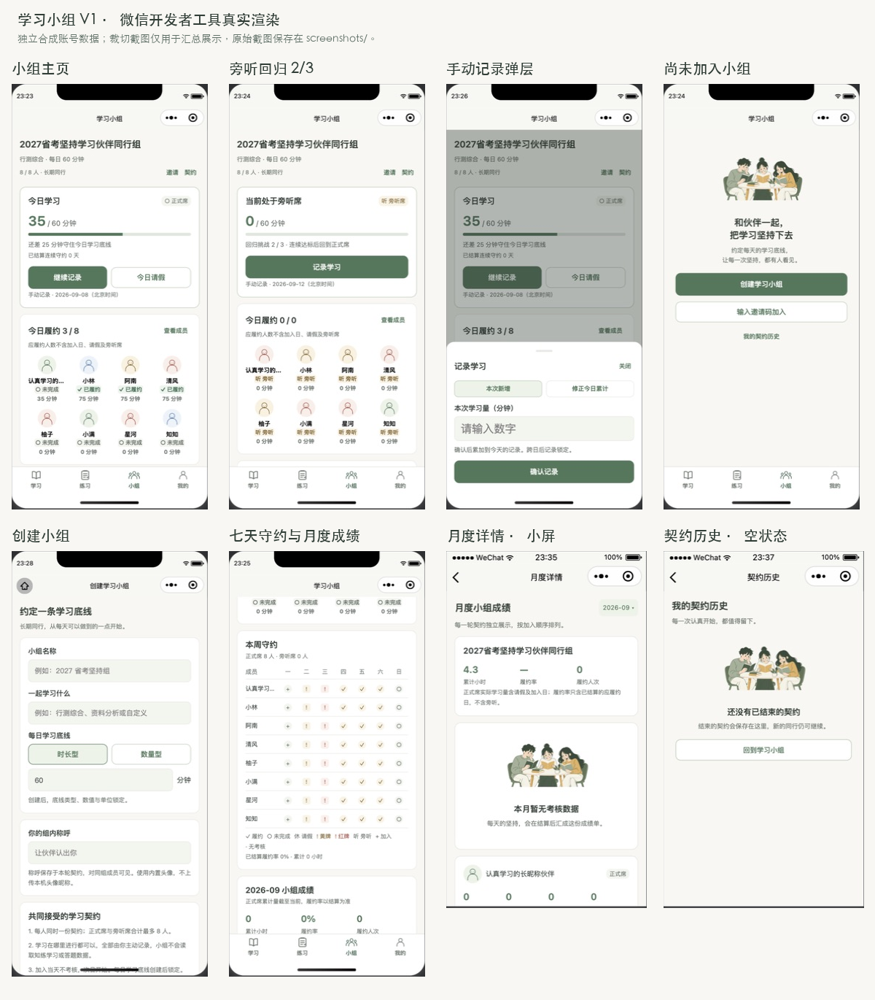

# 学习小组 V1

任务来源：[完整任务书](task.md)。本功能是独立的多人学习契约，不读取知练学习与答题数据。

## 当前交付状态

2026-09-08～09：客户端、服务端、数据库与结算已实现；本轮完整回归 154/154 通过，完成微信开发者工具原生渲染截图检查。**2026-09-09 后端已部署生产，小程序尚未上传发布**，真实微信账号间的完整联调与发布门禁仍待执行。

- 五个页面：小组主页、创建小组、邀请码预览与加入、月度详情、我的契约历史。
- 四项 Tab：学习 / 练习 / 小组 / 我的。记录、邀请、规则、成员列表与详情使用原生底部弹层。
- 八人上限、每人一份当前契约、邀请制、底线锁定、手动新增/修正、请假、黄红牌、旁听回归、退出/重入、归档与历史已接通。
- 复用 Node 24、内置 HTTP/SQLite、现有微信签名会话、协议与请求取消守卫，无新增运行依赖。原 V5 学习流程及题库没有修改。
- 组内称呼由用户单独填写并明确同意展示，与本机个人资料独立；头像来自四个内置资源，不上传本机头像昵称。

## 数据与状态口径

| 场景 | 结果 |
| --- | --- |
| 加入当天 | 可记录，不考核、不加连续守约、不占应履约分母；次日开始 |
| 正式席达到底线 | 日结履约，连续守约 +1 |
| 正式席请假 | 每周一次，仅当天、不可取消；仍可记录，连续守约保持 |
| 同周第一次未履约 | 日结黄牌，仍正式席，连续守约归零 |
| 同周第二次未履约 | 日结红牌，下一业务日为旁听席并开始挑战 |
| 旁听连续三日达标 | 第三日日结后，次日恢复正式席，本周未履约从零开始 |
| 旁听任一考核日未达标 | 日结系统离席、释放席位，保留历史 |
| 主动退出重入原组 | 继承同周未履约和请假用量；原旁听仍旁听，挑战从零开始 |
| 系统离席后重入 | 原组未归档且有空位时开启新契约 |
| 全部成员离开 | 自动归档，邀请码失效，保留所有历史 |

统一北京时间自然日，周键为周一日期。旁听不会因周一自动恢复。例如 9 月 9 日为第二次未履约，则结算后 9 月 10 日为挑战第一天；10～12 日连续成功，13 日恢复正式席。

正式履约率 = 已结算正式履约人次 / 已结算正式应履约人次；剔除加入日、请假、旁听和退出后的日期，无分母显示“—”。今日履约墙单独显示实时达标人数/今日应履约人数。正式累计学习量含加入日、请假和未达标实际量，排除旁听量；今日量实时展示，履约率以结算为准。成员按加入顺序展示，不排序排名。

任务书未给出具体数值的输入边界采用统一常量：名称 1～20 字、主题 1～40 字、组内称呼 1～12 字；时长每日最多 1440 分钟，数量最多 100000，单位为题/个/页/节/套。新增必须为正整数；修正累计允许 0 撤销误填。

重入当天继续作为加入日，但独立继承未完成处罚；退出结束当天义务，已有实际量与请假仍保留，退出日不再产生新缺勤处罚。最长连续守约保留，当前连续守约结束。

## 数据库增量迁移

`server/src/groups/schema.js` 在服务启动时执行事务迁移 v1：

| 表 | 内容与约束 |
| --- | --- |
| study_groups | 小组、不可变底线、全局唯一邀请码、发起人与归档时间 |
| group_memberships | 每轮契约、席位、连续守约、周计数、挑战进度、结算游标；当前正式/旁听 user_id 部分唯一 |
| group_daily_records | 每轮契约每天一条，累计量、revision、当天席位、请假、日结与牌结果；复合主键 |
| group_events | 加入、履约、请假、黄红牌、旁听、回归、退出、系统离席等审计事件；契约/日期/事件唯一 |
| group_requests | 用户/请求 ID 唯一，保存请求指纹及成功响应，防重放重复计量 |
| group_schema_migrations | 已应用的迁移版本 |

不删除或重写既有用户、学习与答题表。加入在 `BEGIN IMMEDIATE` 中检查八人容量与用户当前契约；修正累计使用 revision 检测并发覆盖。部署前按现有 SQLite 备份规范备份，回滚应用代码时保留新增表；不提供会删除历史数据的 down migration。

## API

以下接口均沿用 `Authorization: Bearer`，用户身份取自认证；错误继续使用 `{ code, message }`。健康检查额外返回 `groupVersion: 1`。

| 方法 | 路径 | 用途 |
| --- | --- | --- |
| GET | /v1/groups 或 /v1/groups/current | 当前小组及完整 Dashboard |
| POST | /v1/groups | 创建并加入 |
| GET | /v1/groups/preview?code=ABC234 | 预览契约、容量、归档及处罚继承，不自动加入 |
| POST | /v1/groups/join | 接受契约加入 |
| POST | /v1/groups/exit | 主动退出 |
| POST | /v1/groups/today | 增加今天手动记录 |
| PATCH | /v1/groups/today | 修正今天累计值 |
| POST | /v1/groups/day-off | 今日请假 |
| GET | /v1/groups/members/:membershipId | 当前同组成员详情 |
| GET | /v1/groups/month?month=YYYY-MM | 月度聚合及各轮契约统计 |
| GET | /v1/groups/rules | 统一规则与契约条款 |
| GET | /v1/groups/history?before=cursor | 本人已结束契约，每页 20 条 |

所有写操作带 `requestId`。创建包含 `name/studyTopic/baselineType/baselineValue/baselineUnit/nickname/accepted`，加入包含 `code/nickname/accepted`。记录和请假必须含 `membershipId/date`，记录另含 `value`，PATCH 必须含当前 `revision`；退出必须含 `membershipId`。输入、成员资格、容量、日期与权限由服务端重新校验。

小组写入需要在线确认。网络失败展示错误，不伪造成功，不进入原学习离线事件队列；同一记录弹层内重试复用 requestId，跨日或 revision 冲突先刷新。学习与答题仍保持原有本地优先和离线补传。

## 定时结算

`server/src/index.js` 启动 `groups/scheduler.js`。主路径为北京时间每日 00:05；服务启动补偿，失败记录日志并在 60 秒后重试，每批最多 32 份契约，批间让出事件循环。用户请求先补结算相关小组，再读取或写入当天数据。

成员结算游标按日期逐日推进，写入事务、每日 settled 标识和唯一事件共同保证幂等。系统离席即停止后续补算。退出时关闭调度定时器。日志只带事件类型、小组/契约 ID、业务日期，不记录令牌或学习内容。

Dashboard 一次返回成员墙、七天状态、今日及周月汇总，复用批量每日记录；历史页一次批量读取本页记录，避免逐成员请求或查询。

## 主要文件

- 客户端：`miniprogram/pages/study-group/`、`group-create/`、`group-join/`、`group-month/`、`group-history/`；`utils/groupRules.js`、`groupApi.js`、`groupView.js`、`styles/groups.wxss`、`assets/groups/`。
- 集成：`app.json`、`custom-tab-bar/`、`utils/accountNavigation.js`、`utils/cloudSync.js` 的认证请求导出；`config/product.js` 与 `data/legal.js` 更新协议草稿。
- 服务端：`server/src/groups/{schema,service,routes,scheduler}.js`，接入 `database.js`、`api.js`、`index.js`。
- 测试：`server/test/groups.test.js`、`groups-api.test.js`、`group-fixture.js`、`tests/study-groups.test.js`、`tests/tab-navigation.test.js`。
- 视觉工具：`scripts/group-visual-fixtures.js`、`scripts/prepare-group-preview.js`，均在小程序打包目录外。

## 视觉资产与原生截图

先用当前环境高质量 GPT Image 能力生成 [主页视觉参考](visual-reference.png)，再单独生成透明伙伴插画；[提示词记录](image-prompts.txt)。最终伙伴图裁切缩放、压缩为 `miniprogram/assets/groups/companions.png`（约 29 KB）。其余图标使用现有线性风格；所有页面布局、文字、状态和按钮均为原生 WXML/WXSS，未使用整张生成 UI 冒充页面。

原始截图在 [screenshots](screenshots/)：01～16 依次覆盖单人、满员、全部未完成、部分完成、全部完成、请假、请假仍学习、黄牌、本人旁听 0/3、2/3、回归、七人旁听、全员旁听、无月考核数据、数量、时长。17～30 补充空组、七天表、弹层、规则滚动底部、成员详情、邀请、创建、小屏、月度详情和空历史。

实际使用微信开发者工具 Stable 2.02.2608040 / 基础库 3.17.0，iPhone 12/13 Pro 与 iPhone 5 预设。检查长组名、长昵称、八人布局、七列状态、安全区、按钮、弹层、长数字和滚动。发现自定义 TabBar 遮住弹层确认按钮后，修复隐藏/恢复逻辑并重新截图；长契约改为原生 scroll-view，底部退出操作可见。七天截图 18 留存修正前的旁听达标符号，最终代码改为“回”，与正式履约“✓”区分。

视觉数据由真实服务端状态机在内存 SQLite 和合成账号中生成。预览使用隔离副本，关闭生产登录、同步和数据写入；**这是真实原生渲染验证，不是真实微信网络端到端验证**。恢复了原项目配置，删除工作区临时副本，生产代码不包含测试适配器。

复现入口：在仓库根运行 `node scripts/prepare-group-preview.js /private/tmp/zhilian-group-preview-review`，然后导入该独立目录。开发者工具 Console 可切换 `getApp().globalData.groupFixture` 为脚本中的场景键，再调用当前页 `load()`。该副本的所有写操作明确报错，不能用于业务成功验收。本轮独立导入遇到开发者工具已有代理连接错误，因此曾临时在已打开项目中指向隔离副本完成渲染，现已还原。

## 验证证据与限制

**Validation: L4（用户明确要求全量回归与真实截图）。**

| 类型 | 本轮执行与结果 |
| --- | --- |
| Unit / 前端状态 | 已包含于最终 npm test；加入日、记录修正、请假、牌、跨周、回归、处罚继承、失败重试、Tab 等通过 |
| Backend / Integration | 已包含于最终 npm test；内存 SQLite 与回环临时 HTTP，身份隔离、并发最后席位、请求幂等、归档、旧用户表及重开迁移通过 |
| 完整回归 | 最终代码 `npm test`：154 tests / 154 pass / 0 fail / 0 skip，约 4 秒；覆盖原学习、复习、账号、存储和同步 |
| lint / typecheck | 项目没有独立脚本，也未新增工具链；不宣称执行了不存在的检查 |
| 静态检查 | 27 个本次 JS 的 node --check、JSON 解析、diff --check 与文档链接检查全部通过；已核对配置恢复及打包目录无视觉测试适配器 |
| build / mini-program validation | 没有 CLI build 脚本；已执行微信开发者工具原生编译与上述截图检查，无上传发布 |

未完成真实微信账号间邀请卡片送达、真实 wx.login 联调、手机软键盘/真机差异、正式上传包体与生产日结验收；本地开发阶段没有操作生产用户数据；后续已授权部署见下方记录。补充检查时开发者工具已回到空项目列表，邀请码错误/满员/归档及有内容历史已由代码和 API 测试覆盖，尚无对应原生页面截图。

V1 不包含自动统计、聊天、公开广场、排名、管理员审批或人工处罚、任务型目标、历史补记、底线编辑。未增加这些范围。

## 部署与接管

部署先服务端后客户端，必须同步 `server/src` 以及 `miniprogram/utils/groupRules.js`，并继续包含原 V5 的 `learningModel.js` 与 `memoryScheduler.js`，保留相对目录结构。先备份 SQLite，升级后核对 `/health` 的 groupVersion 与 V5 能力；随后验证真实账号创建/邀请/加入/记录/请假/跨日结算，以及原学习离线补传。

协议草稿版本更新为 `2026-09-08-groups-draft`，既有用户需重新同意；正式协议主体、微信后台隐私指引及已有发布条件仍需落实，不能仅修改发布开关。功能提交包含客户端、服务端、测试及验收文档；原有 project.config.json 的本机改动与用户材料目录保留，不纳入功能提交。后端已按用户 2026-09-09“执行”授权部署。

### 本机编译排障（2026-09-09）

恢复正式根目录后，Stable 2.02.2608040 在欢迎页报告 `summer-compiler` 找不到 `/components/ui-entry/index.json`。实际组件四文件齐全，七处组件引用均能解析；重开项目与仅清文件缓存后仍失败。将本机 `project.private.config.json` 的 `setting.ignoreDevUnusedFiles` 从 true 改为 false 后，真实项目重新编译成功并显示欢迎页。此项为开发者工具的无依赖文件过滤设置，不改变业务代码、上传过滤开关或用户存储；私有配置继续不入 Git。若其他电脑复现同样错误，先核对实际文件，再关闭该项并重编译，不删除学习数据。

### 域名与服务连接排障（2026-09-09）

项目详情已显示正确 AppID 与 request 域名，但模拟器曾只加载腾讯云默认域名，并报 `url not in domain list`。刷新域名、重新编译和重开项目无效；完整退出微信开发者工具后再启动，域名拦截消失。没有关闭 urlCheck，也没有清除数据或授权缓存。

随后真实小程序 GET `/v1/groups` 收到 404；匿名 HTTPS 检查同样返回 `{code:"NOT_FOUND",message:"接口不存在"}`，`/health` 返回 200 且无 V5/groupVersion，确认生产仍为旧服务。客户端现显示“学习小组服务暂未开放”。部署尚未执行，不能将网络恢复表述为小组已可用。

补充区分微信 errMsg 的合法域名拦截与超时，防止统一误报断网；`node --test tests/study-groups.test.js` 11/11 通过，groupApi 语法检查通过，实际小程序编译与错误状态显示已验证（Validation: L2）。

### 生产部署结果（2026-09-09）

用户确认后已部署 V5 + 小组后端，批次 `20260909T030631Z`；完整细节与备份/回滚位置见 [服务端部署记录](../../server/README.md#2026-09-09-部署记录)。服务器候选测试 30/30 通过，运行文件校验一致，数据库备份完整，原五表全部行内容在迁移前后不变。公网 HTTPS 返回四项新版本，匿名小组接口返回 401，现有微信会话的小组首页读取成功，404 阻塞解除。

Validation: L4。复用本轮相同代码的完整 154 项回归与后续 groupApi 定向 11 项验证；新增服务器 Node 24.19 环境的 30 项接口测试、实际增量迁移校验、HTTPS 健康与认证边界、小程序真实小组读取。没有创建生产演示小组或替用户接受小组契约。跨账号邀请/创建/记录、真机软键盘、午夜实际日结与客户端上传发布仍待验证。

自动审批曾要求补充真实微信登录与待同步记录的数据授权；用户明确回复“允许验证真实登录与同步”后继续。真实 wx.login 与现有服务器认证返回 200 且取得令牌（日志仅输出成功布尔值）；原有同步完成，state=ready、lastError 为空；学习与答题待发队列均为 0，dirty=false、resetPending=false。没有生成新学习记录或创建测试小组。

[真实生产连接与脱敏同步结果截图](screenshots/31-production-connected.png)。未再出现域名拦截；完整真机断网再学习、跨账号契约写入、午夜日结与客户端上传仍为后续验收范围。
