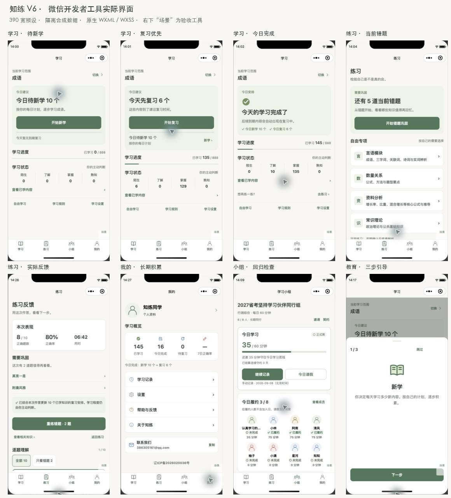

# V6 原生截图索引

截图来自微信开发者工具隔离项目，使用生产页面与现有学习模型；数据为合成验收场景，不代表用户真实进度。完整窗口 PNG 保留工具和设备信息，TXT 为当时页面的无障碍文本。右下角“场景”仅存在于隔离副本，不进入正式包。

## 场景列表

- [00-first-implementation](00-first-implementation.png)（390×844）
- [00-first-review](00-first-review.png)（390×844）
- [01-study-empty](01-study-empty.png)（390×844）
- [02-study-new](02-study-new.png)（390×844）
- [03-study-review](03-study-review.png)（390×844）
- [04-study-many](04-study-many.png)（390×844）
- [05-study-new-done](05-study-new-done.png)（390×844）
- [06-study-review-done](06-study-review-done.png)（390×844）
- [07-study-complete](07-study-complete.png)（390×844）
- [08-study-all](08-study-all.png)（390×844）
- [09-study-long](09-study-long.png)（390×844）
- [10-study-one](10-study-one.png)（390×844）
- [11-study-200](11-study-200.png)（390×844）
- [12-practice-empty](12-practice-empty.png)（390×844）
- [13-practice-wrong](13-practice-wrong.png)（390×844）
- [14-practice-learned](14-practice-learned.png)（390×844）
- [15-practice-modules](15-practice-modules.png)（390×844）
- [16-practice-topics](16-practice-topics.png)（390×844）
- [17-practice-setup](17-practice-setup.png)（390×844）
- [18-assessment-setup](18-assessment-setup.png)（390×844）
- [19-exam-answer](19-exam-answer.png)（390×844）
- [20-result-wrong](20-result-wrong.png)（390×844）
- [21-exam-feedback](21-exam-feedback.png)（390×844）
- [22-result-correct](22-result-correct.png)（390×844）
- [23-me-empty](23-me-empty.png)（390×844）
- [24-me-custom](24-me-custom.png)（390×844）
- [25-me-data](25-me-data.png)（390×844）
- [26-group](26-group.png)（390×844）
- [27-guide-new](27-guide-new.png)（390×844）
- [28-guide-review](28-guide-review.png)（390×844）
- [29-guide-practice](29-guide-practice.png)（390×844）
- [30-learning-rules](30-learning-rules.png)（390×844）
- [31-learning-rules-scroll](31-learning-rules-scroll.png)（390×844）
- [32-guide-closed](32-guide-closed.png)（390×844）
- [33-study-settings](33-study-settings.png)（390×844）
- [34-new-card](34-new-card.png)（390×844）
- [35-new-card-revealed](35-new-card-revealed.png)（390×844）
- [36-new-card-next](36-new-card-next.png)（390×844）
- [37-review-card](37-review-card.png)（390×844）
- [38-history](38-history.png)（390×844）
- [39-me-due](39-me-due.png)（390×844）
- [40-me-large-narrow](40-me-large-narrow.png)（320×568）
- [41-study-long-narrow](41-study-long-narrow.png)（320×568）
- [42-guide-narrow](42-guide-narrow.png)（320×568）
- [43-guide-skipped-narrow](43-guide-skipped-narrow.png)（320×568）
- [44-new-card-narrow](44-new-card-narrow.png)（320×568）
- [45-result-narrow](45-result-narrow.png)（320×568）
- [46-me-complete](46-me-complete.png)（390×844）

00 开头保留第一轮样式；20/22和27–29已更新为最终视觉修订。10/11、14、16–19同时覆盖长分类名：第一轮隔离预览的长名称曾保留到后续场景，已修正预览脚本为克隆副本，正式题库文件从未改动。

40–45为320窄屏，其余为390标准屏；46是新学10+复习6=今日完成16，39为待复习6。完整测试命令、过程中失败和最终结果见[验证记录](validation.md)。

## 本轮位置与入口反馈修订

修正跳过/关闭/了解更多的微信默认按钮宽度覆盖；标题栏统一对齐；规则安全区移到滚动正文底部；复习状态的新学入口改为描边按钮。Validation: L1，390预设原生编译、规则展开/滚动/关闭及引导截图核对通过；未改JS业务逻辑。

- [调整后汇总](feedback-adjustments.png)
- [复习与新学](47-review-new-button.png)
- [规则标题](48-rules-aligned.png)
- [规则展开到底](49-rules-expanded-bottom.png)
- [首次引导](50-guide-header-aligned.png)

## 首页入口融合调整

- [51：自由学习与辅助卡片探索](51-study-tools.png)（中间方案）
- [52：计划设置与规则就地融合](52-study-contextual-tools.png)
- [53：学习状态与全部已学融合](53-study-state-integrated.png)（当前首页）

后续三轮均为原生模拟器390预设的局部布局验证，Validation: L1。最终「调整计划」位于今日建议卡右上角，「了解规则」融入说明文字，「全部已学」位于学习状态标题右侧；原独立辅助卡片、主动判断副标题与查看已学内容行均已移除。入口点击与对应页面/弹窗已核对，未声称覆盖真机或系统放大字号。
